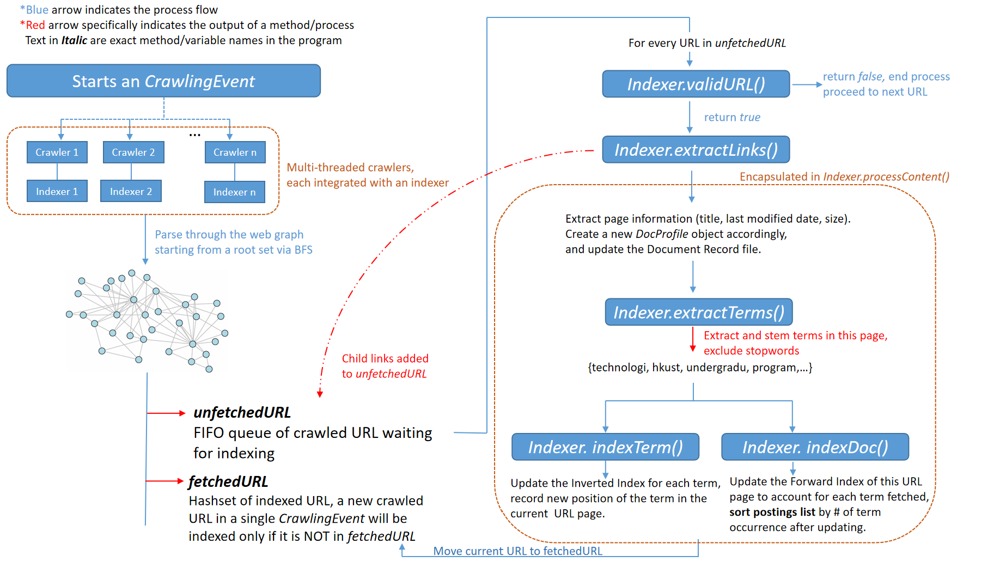
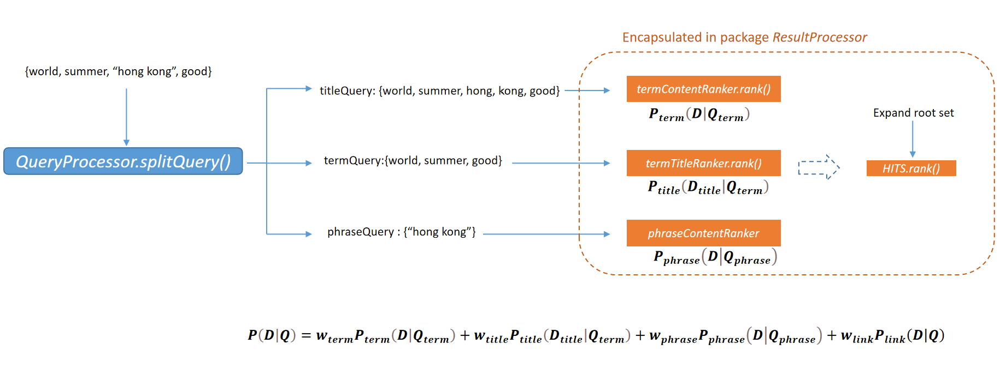

# EasySearch: A search engine built with Java

This is a coursework program for CS4321 at HKUST. The program scraps movie informations from  http://www.cse.ust.hk, stores the scrapped data, and responds to queries.

### Use this program (with IntelliJ)

1. Setup external library dependency
	- Click `[File]->[Project Structure]->[Libraries]`, or press `Ctrl+Alt+shift+s`
	- Click the `+` button at the left-top of the middle section of the panel, or press `Alt+Insert`
	- Under the options, click `Java`
	- You will be prompted to select jar files by parsing through a hierarchy of directories.
	- Locate and click on `src\external\jsoup-1.15.4.jar` , click `Ok`
	- Locate and click on `src\external\jdbm-1.0\lib\jdbm-1.0.jar`, click `Ok`
	- Click `Ok` on the panel to save the changes. The two external packages are now integrated with the project.

2. Run the project
	- On the right-top part of the IDE panel, click the drawdown bar next to the `Build Project` button
	- Select "Edit Configuration", click `Add new` on the left half of the panel
	- In the drawdown list, select `Application`
	- On the right half of the panel, under `Build and run` , select a SDK (java 18/19 are both fine), and fill in `FrontEndPortal.Test` in the `Main class` blank.
	- Click `Ok` to save all changes. 
	- Click the `Run` button (a green triangle icon) to run the project, or press Shift+f10
	- The crawling process will be shown,and after the console sayes `Please input query`， you can enter your line

### Technical Specifics

#### Crawling & Indexing

For sake of easier control and tracking of webpages crawled in a given time period, the project groups the crawling activities starting from a root set of webpages and ending as the number of webpages fetched reach a threshold as a discrete event, represented by the class `CrawlingEvent`. To mimic continuous crawling, the program can instantiates `CrawlingEvent` objects at short intervals.
Each `CrawlingEvent` explores a group of connected webpages using a BFS strategy. 

#### Scoring and Ranking Algorithm

The program transforms query input into several types of input and deliver them to different modules for processing. Each module accounts for a single factor in calculating the final ranking of the returned documents.

This part will focus on the ranking algorithm, which is based on a probability measure that
is based on the similarity of (a) a document’s content to terms in a query, (b) a
document’s title to terms in a query, and (c) a document’s content to phrases in a query.
Denote a webpage as $D = {d_1, d_2, \dots }$ where $d_i$ is a term (after stopword removal and
stemming) in the webpage content. Denote $D_{title} = \set{d_{t1}, d_{t2}, \dots }$ as the terms in the title
of $D$. Denote a query as $Q = \set{t_1, t_2, \dots , ph_1, ph_2, \dots }$ where $t_i$ and $ph_i$ are terms and
phrases in the query, and we split it into $Q_{term} = \set{ t_i | t_i \in Q }$ and $Q_{phrase} = \set{ ph_i | ph_i \in Q }$.

Now, define $P(D|Q) \in [0,1]$ as the probability that given the query $Q$, webpage $D$ is a
relevant page. We then define an aggregation function as follows:

$$
P(D|Q) = w_{term} P_{term}(D|Q_{term}) + w_{title} P_{title}(D_{title}|Q_{term}) + w_{phrase} P_{phrase}(D|Q_{phrase}) + w_{link} P_{link}(D|Q)
$$

In other words, $P(D|Q)$ is a linear combination of three specific probability
measures, which will be introduced in the following subsections.

#### 1 Similarity of Webpage Content Term vs. Query

The first measure, $P_{term}(D|Q_{term})$, is the standard cosine similarity between $D$ and $Q_{term}$. The formula is:

$$
Score_{term}(D|Q_{term}) = \sum_{t \in D \cap Q_{term}} w(t, D)
$$
where
$$
w(t, D) = \frac{TF(t,D) \cdot IDF(t)}{\max(TF(D))}
$$

$$
P_{term}(D|Q_{term}) = \frac{Score_{term}(D|Q_{term})}{\sum_{D_i \in \text{all documents}} Score_{term}(D_i|Q_{term})}
$$

where $w(t, D) = \frac{TF(t,D) \cdot IDF(t)}{\max(TF(D))}$, and assuming that the weight for each term in the query is 1.

In execution, $TF(t, D)$ is recorded in both the corresponding forward index posting of $D$ and the corresponding inverted index posting of $t$. 
$IDF(t)$ is simply the length of the inverted index posting list of $t$.

#### 2 Similarity of Webpage Title Term vs. Query

This measure is similar to$P_{term}(D|Q_{term})$except that only the terms in the
titles are considered.

$$
Score_{title}(D_{title}|Q_{term}) = \sum_{t \in D_{title} \cap (Q_{term} \cup \{ph | ph \in Q_{phrase}\})} w(t, D_{title})
$$

$$
P_{title}(D_{title}|Q_{term}) = \frac{Score_{phrase}(D_{title}|Q_{phrase})}{\sum_{D_i: title|Q_{phrase}} Score_{phrase}(D_i|Q_{phrase})}
$$

where $w(t, D_{title}) = TF(t, D_{title}) \cdot IDF_{title}(t)$,
and assuming that the weight for each term in the query is 1. Considering that the length of the titles is
similar to the length of the query in general, no normalization is applied to
save recording.

#### 3 Similarity of Webpage Content Term vs. Phrase in Query

Comparing with single terms which are usually discrete, it is assumed that
when users input phrases, they are more confident that the terms in the
phrases will locate close to each other. Therefore, when examining the terms
in phrases, their proximity should be taken into account.

This project takes inspiration from the proposed framework of Song & Wen
(2005) and Patterson & Watters (2018) to define the following formula:

$$
Score_{phrase}(D|Q_{phrase}) = \sum_{phr \in Q_{phrase}, t \in phr} \frac{IDF(t)}{w(t, phr, D)}
$$

$$
P_{phrase}(D|Q_{term}) = \frac{Score_{phrase}(D|Q_{phrase})}{\sum_{D_i \in \text{all documents}} Score_{phrase}(D_i|Q_{phrase})}
$$

where

$$
w(t, phr, D) = \sum_{win \in window(t, phr, D)} (1 + \frac{n_{win}}{len(win)})^{\frac{3}{2}}
$$

Here, $window(t, phr, D)$ is a collection of excerpts (windows) in $D$ where $t$, the constituent of phrase $phr$, resides in. $n_{win}$ is the number of constituent terms of $phr$ that the window $win$ contains, and $len(win)$ is the number of terms in $win$.

The rule for constructing the windows is borrowed from Song & Wen
(2005). Given a phrase $phr = \set{p_1, p_2, \dots }$ and a webpage $D = \set{d_1, d_2, \dots }$,
we scan through each occurrence of $p \in phr$ in $D$ following natural order.
We try to divide the chain of occurrences into non-overlapping windows,
each of which containing at most 1 term from $phr$.

When a new occurrence of a term in $phr$ is discovered, there are 4 possible
cases:
- The distance between this occurrence and the last processed
occurrence is farther than a threshold $MAXDIST$. Then we end the
current window, and start a new window with the new occurrence
as the first record;
- The next occurrence is the same term as the last occurrence. Then
also end the current window and start a new one;
- The next hit is a term identical to one of the occurrences recorded
in the current window. If so, we need to break the window by either
ending the current one and start a new one with the new
occurrence, or look-back and break the window at the gap between
the last duplicate occurrence and its next element.
- Otherwise, add the next occurrence to the current window and
move on.

In the program, $MAXDIST$ is set as 2 times the length of the phrase
query. It is obvious that$w(t, phr, D)$has a similar position as the TF term in
calculation. Intuitively, the formula gives higher weights to terms that reside
together with more other terms in the phrase simultaneously in more
windows.

#### 4 Score from Link Structure Mining

After collecting all the webpages with non-zero scores in the previously
defined measures as the root set, we apply the HITS algorithm to collect the
neighborhood pages of the root set and compute their authority and hub
values.

$$
P_{link}(D|Q) = \frac{Hub(D, Q)}{\sum_{D_i \in \text{all documents}} Hub(D_i, Q)}
$$

Although the algorithm is standard, the project’s implementation makes use
of the index file structures efficiently so that the speed of calculation is fast.
